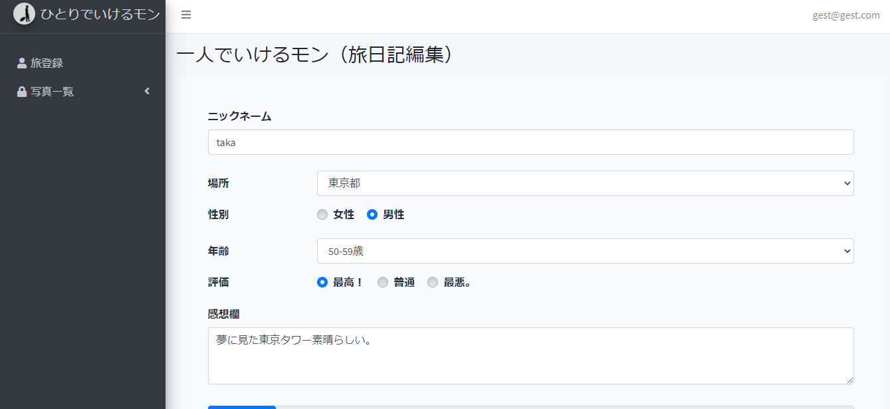

# \:airplane:ひとりでいけるモン
作成者の趣味である一人旅の経験から、一人旅専用の口コミサイトを作成しました。
一人旅が好きな方、一人旅について興味がある方にとっての旅先の参考になればと思い、作成しました。

デモ：https://travel.moto-p.org/

|        トップ画面                |            お問い合わせ画面               |
|---------------------------------|------------------------------------------|
|   |  |


|        ログイン画面                   |           新規登録画面               |
|--------------------------------------|-------------------------------------|
|    |    |


|         管理トップ画面              |
|------------------------------------|
|     |


|             投稿フォーム画面            |             投稿写真一覧画面            |
|----------------------------------------|---------------------------------------|
|   |  |


|         投稿編集画面                    |           投稿詳細画面                |             投稿削除画面　　         |
|----------------------------------------|--------------------------------------|-------------------------------------|
|       |    |  |


## \:notebook:主な機能
```
・サイトメインページ（サイトメイン画面、お問い合わせフォーム画面）
・ログイン画面等（ログイン画面、新規登録画面、パスワード変更画面）
・CRUD機能(作成、編集、更新、削除機能)
・テーブル検索機能
・ページネーション機能
```

## \:wrench:環境構築
```
・Apache 2.4.43
・PHP 7.4.6
・Mysql(MariaDB)  10.4.11 
・Laravel 6.20.7
```

## \:closed_lock_with_key:ダウンロード方法
Githubからダウンロードするかgit cloneしてください。

ダウンロード先
https://github.com/taka-sho0220/laravel-travel.git

git cloneする場合
```
git clone https://github.com/taka-sho0220/laravel-travel.git
```

## \:package:データベース設計


- 会員登録者データベース

データベース名:travel
テーブル名:users

|       Column      |     Type     | Null  | key | Default |　Extra       |
| :---------------: | :----------: | :---: |:---:|  :---:  |    :---:     |   
| id                | bigint(20)   | No    | PRI | None    |auto_increment|
| name              | varchar(191) | No    |     | None    |              |
| email             | varchar(191) | No    |     | None    |              |
| email_verified_at | timestamp    | Yes   |     | Null    |              |
| password          | varchar(191) | No    |     | None    |              |
| remember_token    | varchar(100) | Yes   |     | Null    |              |
| created_at        | timestamp    | Yes   |     | NUll    |              |
| updated_at        | timestamp    | Yes   |     | Null    |              |


- パスワードリセットデータベース

データベース名:travel
テーブル名:password_resets

|   Column   |     Type     | Null  | key | Default |　Extra       |
| :--------: | :----------: | :---: |:---:|  :---:  |    :---:     |   
| email      | varchar(191) | No    |     | None    |              |
| token      | varchar(191) | No    |     | None    |              |
| created_at | timestamp    | Yes   |     | NUll    |              |


- お問い合わせデータベース

データベース名:travel
テーブル名:contacts

|   Column   |     Type    | Null  | key | Default |　Extra       |
| :--------: | :---------: | :---: |:---:|  :---:  |    :---:     |   
| id         | bigint(20)  | No    | PRI | None    |auto_increment|
| name       | varchar(191)| No    |     | None    |              |
| email      | varchar(191)| No    |     | None    |              |
| message    | text        | No    |     | None    |              |
| created_at | timestamp   | Yes   |     | NUll    |              |
| updated_at | timestamp   | Yes   |     | Null    |              |


- 投稿内容データベース

データベース名:travel
テーブル名:travels

|   Column    |     Type     | Null  | key | Default |　Extra       |
| :---------: | :----------: | :---: |:---:|  :---:  |    :---:     |   
| id          | bigint(20)   | No    | PRI | None    |auto_increment|
| name        | varchar(191) | No    |     | None    |              |
| place       | varchar(191) | No    |     | None    |              |
| gender      | varchar(191) | No    |     | None    |              |
| age         | varchar(191) | No    |     | None    |              |
| evaluation  | varchar(100) | No    |     | None    |              |
| impressions | varchar(191) | No    |     | None    |              |
| photos      | varchar(100) | Yes   |     | Null    |              |
| terms       | varchar(191) | No    |     | None    |              |
| created_at  | timestamp    | Yes   |     | NUll    |              |
| updated_at  | timestamp    | Yes   |     | Null    |              |


各種databese設計に関しては、migrationファイル(database/migrations)を作成しております。
コマンドでマイグレーションを行っていただくと、テーブルが作成できます。

```
php artisan migrate
```


## \:open_file_folder:フォルダ構成
```
・app/ アプリのメインフォルダ
　・Http/
 　　・Controllers/
   　　　・HomeController　ログインコントローラー
     　　・TravelController　メインコントローラー
     ・Requests/
         ・ContactRequest お問い合わせのバリデーション
         ・TravelRequest 写真登録のバリデーション
　・Mail/
     ・ContactMail  メール送信の設定
  ・Models
     ・Contact お問い合わせのデータベース設定
     ・Travel 写真登録のデータベース設定
     
・bootstrap/ 処理処理やキャッシュ等のフォルダ
     ・cache/
         ・config 各種管理ページ設定
         
・config/ アプリの設定フォルダ
     ・adminlte adminlteの設定
     
・database/ データベース(マイグレーション)フォルダ
     ・migrations migrrationフォルダ
     
・public/ 画像,JS,CSS等フォルダ
     ・vender adminlteのjs,css
     
・resources/ Blade等(viewの置き場所)フォルダ
     ・view
        ・auth/ ログイン等のview
        ・contact/
            ・mail お問い合わせメールの送信内容
        ・mains/ メインページのview
        ・travel-pages/ ログイン後ページのview
        
・routes/ URL設定フォルダ
      ・web.php route設定ファイル
      
・storage/ セッション及びログフォルダ

・tests/ テスト用フォルダ

・vendor/ Composerの依存内容フォルダ

.env/ 各種設定
```
